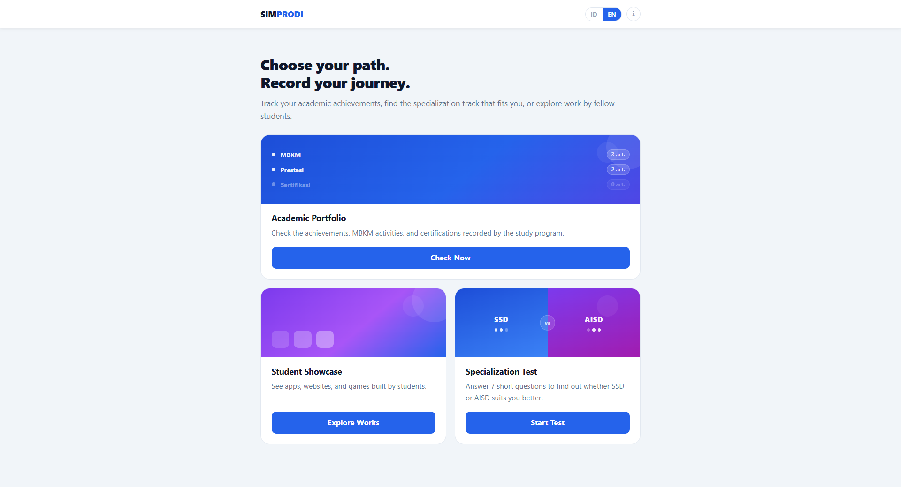
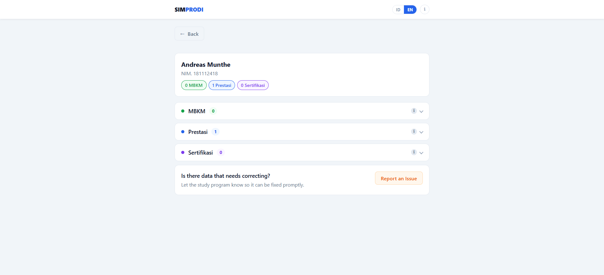
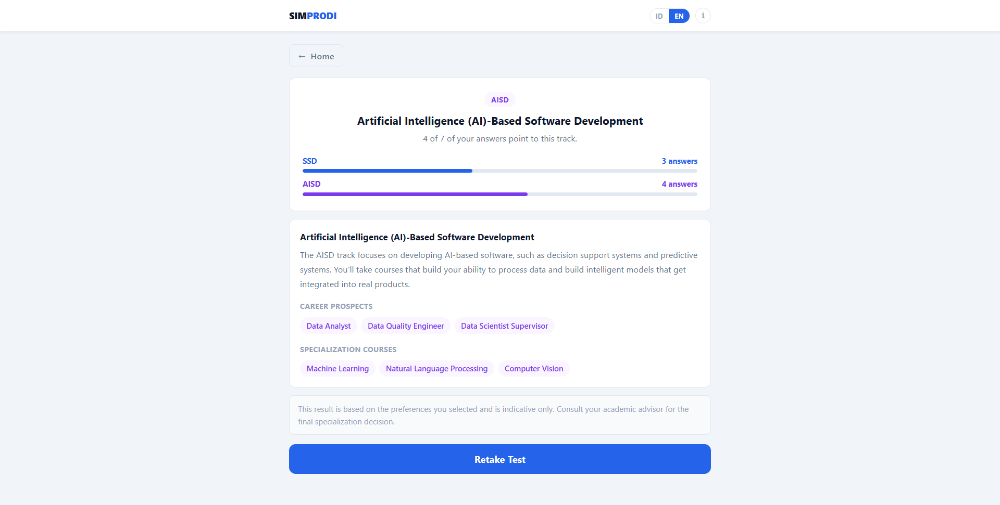
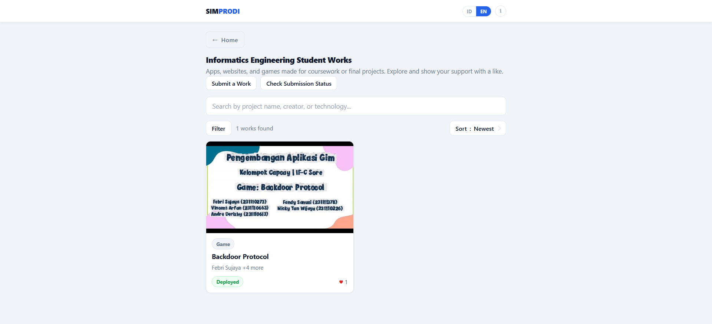

# 🎓 SIMPRODI (Study Program Information System)

A bilingual (Indonesian/English) public portal for an Informatics Engineering study program. Students can look up their academic achievements, take a specialization-track quiz, and browse a gallery of student-built projects - all from a single, no-login static site.

## ✨ Key Features

* **Achievement Lookup:** Search MBKM, Prestasi (awards), and Sertifikasi (certification) records by NIM or name.
* **Data Correction Report:** Students can flag achievement records that look incorrect directly from the search results.
* **Specialization Quiz:** An interactive quiz that recommends a specialization track (SSD or AISD) based on the student's answers.
* **Student Project Showcase:** A public gallery of apps, websites, games, and other student projects, with a full submit → moderation → publish flow, likes, content reporting, submission-status lookup, and edit-and-resubmit for rejected entries.
* **Program Statistics:** A public dashboard of aggregate achievement counts (students, MBKM activities, achievement activities, certifications, showcase projects), with a disclaimer that the numbers are provisional and a report form for anything missing.
* **Bilingual UI:** Every page, including dynamically rendered content, is available in Indonesian and English.
* **Light/Dark Theme:** A manual toggle between light and dark mode, remembered per device.
* **Shareable Clean URLs:** Each main section (`/portofolio/`, `/showcase/`, `/specialization/`, `/statistic/`) is a real, directly linkable page, on top of the existing per-record deep links (`?nim=`, `?kode=`).

## 💻 Application Preview


*Home page.*


*Student achievement detail page.*


*Specialization-track quiz.*


*Student project showcase gallery.*

## 🛠️ Tech Stack

The main technologies used in this project include:

* **Frontend:**
    * HTML5
    * Vanilla JavaScript (ES6+)
    * Custom CSS (no framework)
* **Backend:**
    * [Google Apps Script](https://www.google.com/script/start/) Web App (maintained in a separate private repository, not included here)
* **Database:**
    * Google Sheets

*This repository only contains the static frontend. It communicates with a Google Apps Script backend API for all data - the backend project itself lives in a separate, private repository and is not included here.*

## ⚙️ Installation & Setup

This site is auto-published from a private main repository whenever its `docs/` folder changes, so it isn't meant to be run standalone. To preview the frontend locally:

1.  **Clone this repository:**
    ```bash
    git clone https://github.com/fandipres/simprodi-public.git
    cd simprodi-public
    ```

2.  **Run the application:**

    The pages load their shared markup/styles/script from `assets/` at runtime via `fetch()`, so they need to be served over `http://`, not opened directly as a `file://` path.
    ```bash
    # Any static file server works, for example:
    python -m http.server 8000
    # then open http://localhost:8000/ in your browser
    ```

3.  The static UI will load, but features that fetch or submit data (achievement lookup, the showcase, etc.) require a valid Google Apps Script backend URL configured in `assets/app.js`, which is not part of this repository.

## 🔗 Links

* **Live Demo:** [simprodi.fandipres.my.id](https://simprodi.fandipres.my.id)
* **Repository:** [github.com/fandipres/simprodi-public](https://github.com/fandipres/simprodi-public)

## 📄 License

This is the public-facing site of an internal academic information system for an Informatics Engineering study program. Contact the project owner regarding usage or distribution.